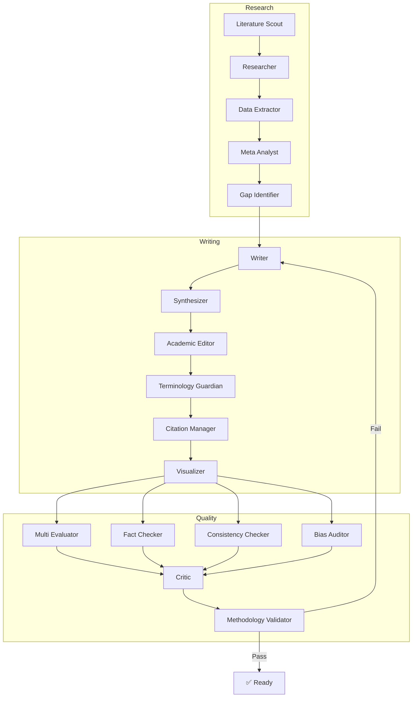

# ResearchFlow Agent Skills

SKILL.md dokumentacija za ResearchFlow multi-agent sistem za avtomatizirano pisanje scoping review člankov.

## 🚀 Quick Start

```bash
# Skills se naložijo avtomatsko ob zagonu ResearchFlow
# Za ročni test YAML sintakse:
python validate_skills.py
```

## 📊 Arhitektura

```
┌─────────────────────────────────────────────────────────────────┐
│                     META ORCHESTRATOR                           │
└───────────────┬─────────────────────────────┬───────────────────┘
                │                             │
    ┌───────────▼───────────┐     ┌───────────▼───────────┐
    │   RESEARCH CLUSTER    │     │   WRITING CLUSTER     │
    │  ┌─────────────────┐  │     │  ┌─────────────────┐  │
    │  │  Researcher     │  │     │  │  Writer         │  │
    │  │  Lit. Scout     │  │────▶│  │  Synthesizer    │  │
    │  │  Data Extractor │  │     │  │  Academic Editor│  │
    │  │  Meta Analyst   │  │     │  │  Term. Guardian │  │
    │  │  Gap Identifier │  │     │  │  Citation Mgr   │  │
    │  └─────────────────┘  │     │  │  Visualizer     │  │
    └───────────────────────┘     │  └─────────────────┘  │
                                  └───────────┬───────────┘
                                              │
                                  ┌───────────▼───────────┐
                                  │   QUALITY CLUSTER     │
                                  │  ┌─────────────────┐  │
                                  │  │  Multi Evaluator│  │
                                  │  │  Fact Checker   │  │
                                  │  │  Consistency    │  │
                                  │  │  Bias Auditor   │  │
                                  │  │  Critic         │  │
                                  │  │  Method Valid.  │  │
                                  │  └─────────────────┘  │
                                  └───────────────────────┘
```

## 📁 Struktura

```
skills/
├── README.md                 # Ta datoteka
├── CHANGELOG.md              # Zgodovina verzij
├── config.yaml               # Centralna konfiguracija
├── validate_skills.py        # YAML validacija
│
├── research-cluster/         # 🔬 Raziskovalni agenti
│   ├── SKILL.md              # Entry point
│   ├── researcher/
│   ├── literature-scout/
│   ├── data-extractor/
│   ├── meta-analyst/
│   └── gap-identifier/
│
├── writing-cluster/          # ✍️ Agenti za pisanje
│   ├── SKILL.md              # Entry point
│   ├── writer/
│   ├── synthesizer/
│   ├── academic-editor/
│   ├── terminology-guardian/
│   ├── citation-manager/
│   └── visualizer/
│
└── quality-cluster/          # ✅ Agenti za kvaliteto
    ├── SKILL.md              # Entry point
    ├── multi-evaluator/
    ├── fact-checker/
    ├── consistency-checker/
    ├── bias-auditor/
    ├── critic/
    └── methodology-validator/
```

## 🔄 Workflow



## 📖 Uporaba

### 1. Research Cluster
```
"Poišči literaturo o AI v HR"
→ Aktivira research-cluster → researcher agent
```

### 2. Writing Cluster
```
"Napiši sekcijo Methods"
→ Aktivira writing-cluster → writer agent
```

### 3. Quality Cluster
```
"Preveri PRISMA skladnost"
→ Aktivira quality-cluster → methodology-validator agent
```

## ⚙️ Konfiguracija

Vse nastavitve so v `config.yaml`:
- Model temperature in max_tokens
- Quality thresholds
- Timeouts
- Rate limiting
- Domain-specific kategorije

## 📚 Reference

- PRISMA-ScR: [doi:10.7326/M18-0850](https://doi.org/10.7326/M18-0850)
- JBI Manual: [doi:10.1097/XEB.0000000000000050](https://doi.org/10.1097/XEB.0000000000000050)
- Arksey & O'Malley: [doi:10.1080/1364557032000119616](https://doi.org/10.1080/1364557032000119616)

## � Python Integration

### Installation

```bash
pip install -r agents/skills/requirements.txt
```

### Basic Usage

```python
from agents import get_skill, get_system_prompt, list_all_skills

# List all 20 skills
for skill in list_all_skills():
    print(skill)

# Load a specific skill
skill = get_skill("research-cluster/researcher")
print(skill.name)          # "researcher"
print(skill.description)   # Full description
print(skill.sections)      # Parsed markdown sections

# Get system prompt for LLM
prompt = get_system_prompt("researcher")
```

### Templates

```python
from agents.skills import load_template, list_templates

# List available templates
templates = list_templates()
# ['conflict-resolution-form', 'data-charting-form', ...]

# Load a template
form = load_template("data-charting-form")
```

### Schema Validation

```python
from agents.skills.templates.schemas import (
    validate_data_charting,
    create_empty_data_charting
)

# Create empty form structure
form = create_empty_data_charting()

# Validate extracted data
errors = validate_data_charting(data)
if errors:
    print("Validation failed:", errors)
```

### IRR Calculator

```python
from agents.skills.templates.scripts import calculate_kappa

rater1 = ["include", "include", "exclude", "include"]
rater2 = ["include", "exclude", "exclude", "include"]

result = calculate_kappa(rater1, rater2)
print(f"Kappa: {result['kappa']:.3f}")
print(f"Interpretation: {result['interpretation']}")
```

### PRISMA Generator

```python
from agents.skills.templates.scripts import generate_prisma_diagram

counts = {
    "identified": 1500,
    "duplicates_removed": 300,
    "screened": 1200,
    "excluded_screening": 800,
    "sought_retrieval": 400,
    "not_retrieved": 20,
    "assessed_eligibility": 380,
    "excluded_eligibility": 180,
    "included": 200
}

# ASCII diagram
print(generate_prisma_diagram(counts, format="ascii"))

# Mermaid markdown
mermaid = generate_prisma_diagram(counts, format="mermaid")
```

## �📋 Statistika

| Metrika | Vrednost |
|---------|----------|
| Skills | 20 |
| Clusters | 3 |
| Agents | 17 |
| Total size | ~115 KB |
| Py modules | 5 |
| YAML valid | 100% |

---

**Verzija:** 2.1.0 | **Datum:** 2026-04-16
