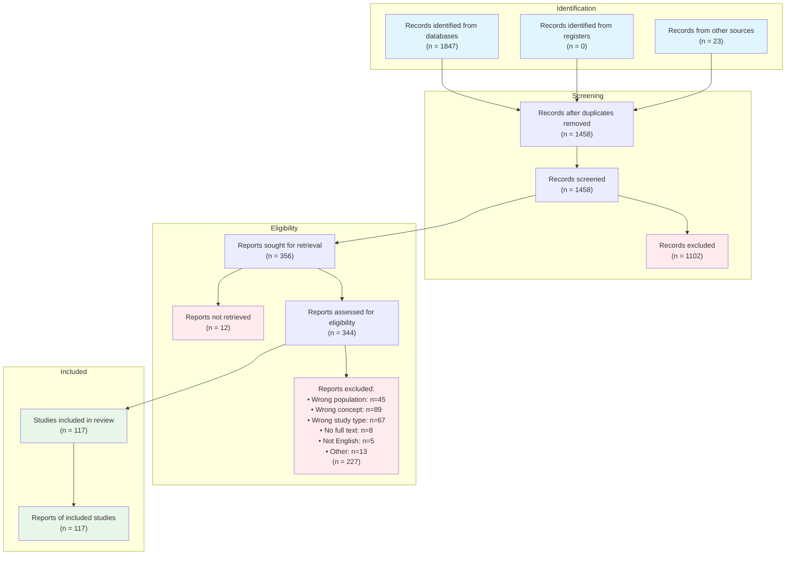

```mermaid
flowchart TD
    subgraph identification["Identification"]
        A1["Records identified from databases\n(n = 1847)"]
        A2["Records identified from registers\n(n = 0)"]
        A3["Records from other sources\n(n = 23)"]
    end

    subgraph screening["Screening"]
        B1["Records after duplicates removed\n(n = 1458)"]
        B2["Records screened\n(n = 1458)"]
        B3["Records excluded\n(n = 1102)"]
    end

    subgraph eligibility["Eligibility"]
        C1["Reports sought for retrieval\n(n = 356)"]
        C2["Reports not retrieved\n(n = 12)"]
        C3["Reports assessed for eligibility\n(n = 344)"]
        C4["Reports excluded:\n• Wrong population: n=45\n• Wrong concept: n=89\n• Wrong study type: n=67\n• No full text: n=8\n• Not English: n=5\n• Other: n=13\n(n = 227)"]
    end

    subgraph included["Included"]
        D1["Studies included in review\n(n = 117)"]
        D2["Reports of included studies\n(n = 117)"]
    end

    A1 & A2 & A3 --> B1
    B1 --> B2
    B2 --> B3
    B2 --> C1
    C1 --> C2
    C1 --> C3
    C3 --> C4
    C3 --> D1
    D1 --> D2

    style A1 fill:#e1f5fe
    style A2 fill:#e1f5fe
    style A3 fill:#e1f5fe
    style B3 fill:#ffebee
    style C2 fill:#ffebee
    style C4 fill:#ffebee
    style D1 fill:#e8f5e9
    style D2 fill:#e8f5e9
```